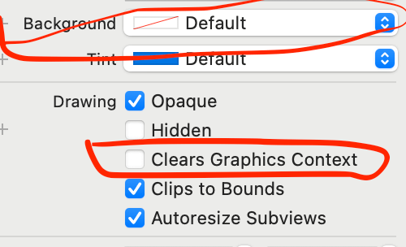

这篇文章深入探究一个iOS开发过程中经常会看到的一个属性，这也是我自己在开发过程中碰到的一个用了我几个小时才解决的问题。

主要涉及到Opaque和Clears Graphics Context（clearsContextBeforeDrawing）两个View属性：

1.  opaque view和non-opaque view
2.  Clears Graphics Context是什么和它的作用
<!-- more -->
这篇文章深入探究一个iOS开发过程中经常会看到的一个属性，这也是我自己在开发过程中碰到的一个用了我几个小时才解决的问题。

主要涉及到Opaque和Clears Graphics Context（clearsContextBeforeDrawing）两个View属性：

1.  opaque view和non-opaque view
2.  Clears Graphics Context是什么和它的作用

> 到公众号【iOS开发栈】学习更多SwiftUI、iOS开发相关内容。

# Opaque属性

> A Boolean value that determines whether the view is opaque.

`Opaque`属性表示视图是不是透明的，YES表示不透明，NO表示透明。

iOS的界面绘制系统会根据这个属性的值来决定怎样绘制界面。

YES的话绘制系统会认为这个View完全不透明，也就是说对于用户来说在这个视图的范围内，只有这个视图会被看到，此时绘制系统就会进行一些优化——在这个视图范围内只绘制这个视图，进而减少绘制工作来优化性能。

`opaque`是NO表示视图是透明，也就是说用户会看到它后面的视图，显然这样的话会加大绘制的层级，从而影响到App的性能。

_`opaque`属性对性能的影响在静止的界面中微乎其微，主要用在对滚动界面（UIScrollView/UITableView/UICollectionView）的优化中。_

设置`opaque`为YES表示`alpha`等于1，如果设置了opaque是YES，但是alpha小于1的话，opaque属性会失效。

# Clears Graphics Context

在Interface Builder的Show the attributes inspector分栏中，可以找到Clears Graphics Context复选框，我在过去几年的iOS开发生涯中无数次的使用过IB文件，却一直忽略了这个选项，直到前几天发现了一个奇怪的现象。

这不是把两个label重叠在一起了，而是先后给同一个label设置了“777”和“999”两个字符串——`label.text = @""`。那么问题是为什么会这个现象呢？

其实想要出现这个现象也并不容易，首先要把这个label的背景色设置成`default`（其他任何颜色都不行），其次要把`Clears Graphics Context`的复选框设置为不选中的状态，只满足这两个条件你会发现也不会出现这个问题，经过我的反复试验总结发现，只有当当前label不在屏幕内时——比如push到（或者present出）另一个页面时设置text才会出现这个现象。

在IB中设置`Clears Graphics Context`和代码设置`clearsContextBeforeDrawing`是一样的。

> A Boolean value that determines whether the view’s bounds should be automatically cleared before drawing.

_这个属性表示是否要在绘制界面前把当前视图的内容清除。_也就是说，如果把这个属性设置成NO，那么当下次更改视图内容时，上一次的内容会保留，就会出现两个内容同时存在，也就是我遇到的label同时出现了“777”和“999”两个字符串。

了解了这一点以后，解决这个问题就很简单了，只需要把`Clears Graphics Context`勾选上就可以了。

> 到公众号【iOS开发栈】学习更多Swift、SwiftUI、iOS开发相关内容。
